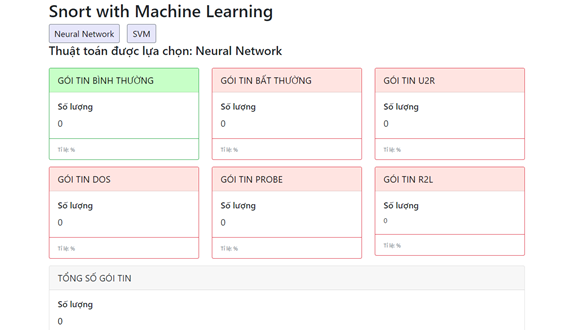

# Description

Fix cannot predict attack packets

Add new algorithm ANN, SVM

Change analyzing packet structure by using queue to store incoming packets to python server

reduce 41 features to 28 features (remove 10-22 features in kdd)

Datasets from: https://github.com/defcom17/NSL_KDD

Code based on:

https://github.com/AnomalyIDSBenchmark

https://github.com/dthongvl/ids-machine-learning

Feature Extractor from: https://github.com/AI-IDS/kdd99_feature_extractor

[17/10/2021] Update setup docs in [docs](./docs/Howtosetup.docx) (Vietnamese Version)

# GUI

